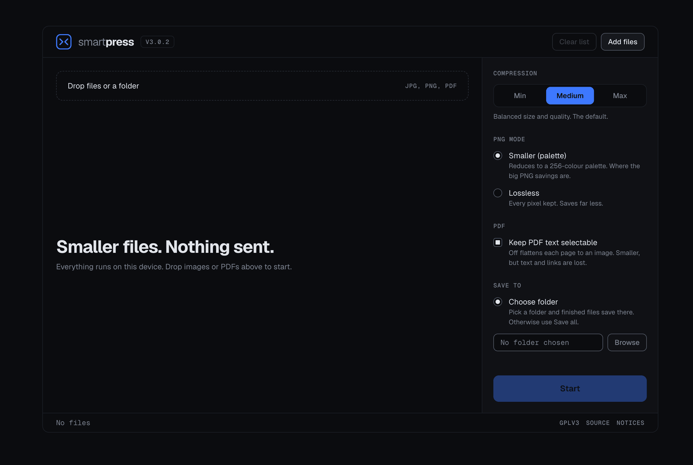
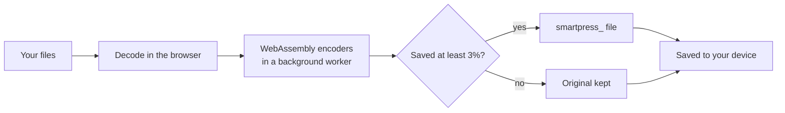

<div align="center">


# SmartPress

**Smaller images and PDFs. Nothing sent.**

A compressor that runs entirely on your device: in the browser, as an installable app that works offline, or as a macOS desktop app.

[**Open SmartPress →**](https://smartpress.namka.cloud)




</div>

---

## Why SmartPress

Most online compressors send your files to a server. SmartPress doesn't. Every encoder is compiled to WebAssembly and shipped with the app, so compression happens on your machine. There's no account, no tracking, and no file ever leaves the device. Once loaded, it keeps working with the network switched off.

## Features

- **Images: JPEG, PNG and WebP output.** PNGs are reduced to a 256-colour palette by default, which is where the large savings are, or kept lossless if every pixel matters.
- **PDFs, without breaking them.** Embedded images are recompressed and text stays selectable and searchable. An optional flatten mode turns each page into an image for the smallest size. Signed PDFs are left untouched, because re-saving would invalidate the signature.
- **Three presets instead of a slider.** Min, Medium (the default) or Max, calibrated per format against real fixtures.
- **Honest results.** If compression saves less than 3%, you get your original file back. PNGs that would be smaller as WebP say so, and convert in one click, singly or in bulk.
- **Batches and folders.** Drop a whole folder and save everything at once: straight into a folder you choose in Chromium browsers, or as one ZIP elsewhere.
- **Installable and offline.** Install it from the browser and it runs like an app, offline included.
- **Desktop app for macOS.** Adds what a browser can't: save next to the originals, a native folder picker and Show in Finder.

## How it works



| Format | Engine |
|---|---|
| JPEG, WebP | [`@jsquash`](https://github.com/jamsinclair/jSquash) (MozJPEG, libwebp) |
| PNG | [libimagequant](https://github.com/ImageOptim/libimagequant) palette quantisation, vendored as WebAssembly |
| PDF | [`pdf-lib`](https://github.com/Hopding/pdf-lib) for image recompression; [`pdf.js`](https://github.com/mozilla/pdf.js) for optional flattening |

Everything is vendored into `public/`. The app makes no network requests to process a file and loads nothing from a CDN.

## Use it

- **In the browser:** [smartpress.namka.cloud](https://smartpress.namka.cloud). Drop files or a folder, pick a preset, press Start.
- **As an app:** in Chrome or Edge, click the install icon in the address bar. It then works offline.
- **On macOS:** build the desktop app locally (below). It isn't signed or distributed yet.

## Development

Requires Node.js 20+.

```bash
npm ci
npm run dev        # http://localhost:3000
npm run build      # static export to out/
```

> **Verify against the build, not dev.** `next dev` uses webpack and `next build` uses Turbopack, and they resolve WebAssembly and worker URLs differently. A change to codecs, workers or asset paths isn't done until it works in `out/`. See [`CLAUDE.md`](CLAUDE.md) for the full set of working rules.

The build runs three post-build scripts: one prunes dev-only routes and test fixtures, one injects the service-worker precache list, and one fails the build if anything that shouldn't ship is in `out/`.

### Desktop app (macOS)

The same code runs in a [Tauri 2](https://tauri.app) window from `src-tauri/`. You need Xcode Command Line Tools and [Rust](https://rustup.rs).

```bash
npm ci
npm run tauri build -- --bundles app
# → src-tauri/target/release/bundle/macos/SmartPress.app
```

The desktop build sets `NEXT_PUBLIC_TARGET=desktop`. That adds **Same as source**, which writes `smartpress_<name>` next to each original and never overwrites it. It also turns off the service worker. File access is granted only to what you pick or drop. The web build contains none of the desktop code.

### Deploying

`out/` is a plain static site. Build with `NEXT_PUBLIC_TARGET=web` and copy `out/` to any static host. `public/.htaccess` sets the headers the app relies on: no-cache for HTML and the service worker, immutable caching for hashed assets, and the `application/wasm` MIME type. Hosts without `.htaccess` need equivalent rules.

### Project layout

```
app/                 Next.js routes (the app, /licenses)
components/          UI
lib/codecs/          Decode, encode and PDF pipeline; quality curves
lib/save/            Saving: web (folder picker / ZIP) and desktop (Tauri)
public/wasm, pdfjs/  Vendored WebAssembly encoders and pdf.js assets
src-tauri/           macOS desktop wrapper
docs/design-system/  Design tokens and component specs
scripts/             Post-build prune, service-worker injection, export guard
```

## Known limitations

- **AVIF output is off.** The encoder hangs the production build, and re-enabling it is a one-flag change once that's fixed.
- **No PDF flatten in the desktop app** on macOS 13. Text is always kept there. The web app flattens normally.
- Older Safari can't save into a chosen folder, so files arrive as a ZIP.

## Licence

SmartPress is licensed under the [GNU General Public License v3.0 or later](LICENSE).

The GPL is deliberate. PNG palette quantisation via libimagequant cuts PNGs by roughly 87–93% in our benchmarks, against about 20% for lossless optimisation alone, and libimagequant is GPL for open-source use. Third-party components and the provenance of every vendored binary are listed in [`NOTICE`](NOTICE), and the running app links to them from its footer.

## Author

Built by **Ali Mora**, Johannesburg ([@AliMora83](https://github.com/AliMora83)). Issues and suggestions are welcome via [GitHub Issues](https://github.com/AliMora83/SmartPress/issues).

<sub>Changelog and design decisions: [`AI-Logs.md`](AI-Logs.md) · Plan of record: [`SmartPress-v3-Plan.md`](SmartPress-v3-Plan.md)</sub>
